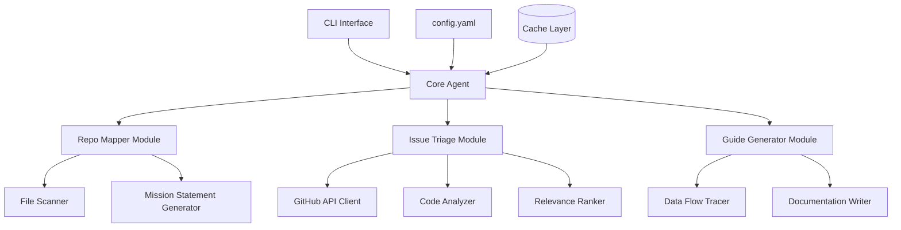
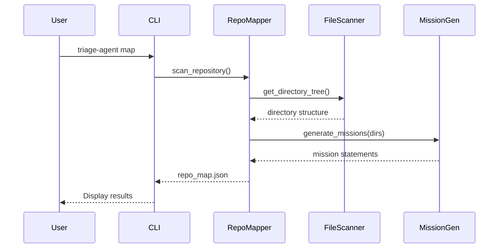
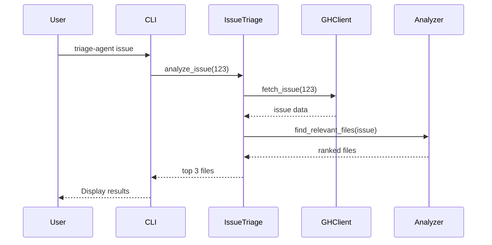
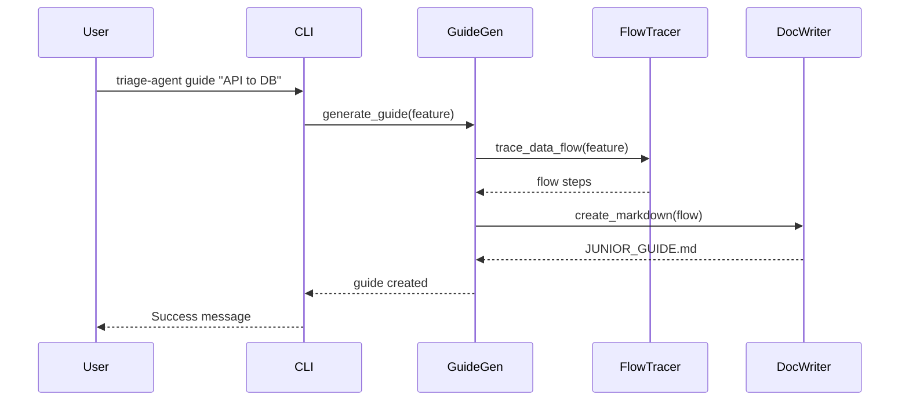

# Developer Triage Agent - Implementation Plan

## Project Overview
A Python-based tool to help junior developers navigate complex repositories by providing:
1. **Repo Mapping**: Automatic project structure analysis with mission statements
2. **Contextual Triage**: GitHub issue-to-file mapping
3. **Onboarding Guide**: Automated data flow documentation

## System Architecture



## Module Breakdown

### 1. Repo Mapper Module
**Purpose**: Scan project structure and generate mission statements

**Flow**:


**Key Functions**:
- `scan_repository()`: Walk directory tree
- `analyze_folder_purpose()`: Infer folder purpose from contents
- `generate_mission_statement()`: Create human-readable descriptions

### 2. Contextual Triage Module
**Purpose**: Map GitHub issues to relevant files

**Flow**:


**Key Functions**:
- `fetch_github_issue()`: Get issue details via API
- `extract_keywords()`: Parse issue for relevant terms
- `rank_files_by_relevance()`: Score files based on content match

### 3. Onboarding Guide Generator
**Purpose**: Create JUNIOR_GUIDE.md with data flow explanations

**Flow**:


**Key Functions**:
- `trace_data_flow()`: Follow code execution paths
- `identify_key_components()`: Find critical files/functions
- `generate_markdown_guide()`: Create formatted documentation

## Project Structure

```
my-bob-project/
├── .venv/                      # Virtual environment (ignored)
├── src/
│   └── triage_agent/
│       ├── __init__.py
│       ├── cli.py              # CLI interface
│       ├── core.py             # Main agent logic
│       ├── config.py           # Configuration management
│       ├── repo_mapper/
│       │   ├── __init__.py
│       │   ├── scanner.py      # File system scanner
│       │   └── mission.py      # Mission statement generator
│       ├── issue_triage/
│       │   ├── __init__.py
│       │   ├── github_client.py # GitHub API integration
│       │   ├── analyzer.py     # Code analysis
│       │   └── ranker.py       # File relevance ranking
│       └── guide_generator/
│           ├── __init__.py
│           ├── tracer.py       # Data flow tracer
│           └── writer.py       # Documentation writer
├── tests/
│   ├── __init__.py
│   ├── test_repo_mapper.py
│   ├── test_issue_triage.py
│   └── test_guide_generator.py
├── .gitignore
├── README.md
├── pyproject.toml
├── config.yaml.example
└── IMPLEMENTATION_PLAN.md
```

## Technology Stack

### Core Dependencies
- **uv**: Fast Python package installer and resolver
- **click**: CLI framework
- **PyGithub**: GitHub API client
- **pathlib**: File system operations
- **pyyaml**: Configuration management
- **rich**: Terminal formatting and progress bars

### Optional/Future
- **tree-sitter**: Advanced code parsing
- **openai/anthropic**: AI-powered analysis
- **networkx**: Dependency graph visualization

## Implementation Phases

### Phase 1: Foundation (Current Task)
- [x] Initialize uv project
- [ ] Create .gitignore
- [ ] Create README.md
- [ ] Commit to GitHub

### Phase 2: Core Structure
- [ ] Set up project modules
- [ ] Add dependencies to pyproject.toml
- [ ] Create configuration system
- [ ] Build CLI skeleton

### Phase 3: Repo Mapper
- [ ] Implement file scanner
- [ ] Build mission statement generator
- [ ] Add caching for performance
- [ ] Create output formatter

### Phase 4: Issue Triage
- [ ] Integrate GitHub API
- [ ] Implement keyword extraction
- [ ] Build relevance ranking algorithm
- [ ] Add file content analysis

### Phase 5: Guide Generator
- [ ] Implement data flow tracer
- [ ] Build markdown generator
- [ ] Add template system
- [ ] Create example guides

### Phase 6: Polish & Testing
- [ ] Write comprehensive tests
- [ ] Add error handling
- [ ] Create documentation
- [ ] Performance optimization

## Configuration Example

```yaml
# config.yaml
github:
  token: ${GITHUB_TOKEN}
  repo: mpagi-shafiq/Project-Atlas
  
repo_mapper:
  ignore_patterns:
    - .venv
    - __pycache__
    - node_modules
  max_depth: 5
  
issue_triage:
  max_files: 3
  relevance_threshold: 0.6
  
guide_generator:
  output_file: JUNIOR_GUIDE.md
  template: default
```

## CLI Usage Examples

```bash
# Initialize configuration
triage-agent init

# Map repository structure
triage-agent map --output repo_structure.json

# Analyze GitHub issue
triage-agent issue 123 --repo mpagi-shafiq/Project-Atlas

# Generate onboarding guide
triage-agent guide "API request flow" --feature authentication

# Interactive mode
triage-agent interactive
```

## Success Metrics

1. **Repo Mapping**: Generate accurate mission statements for 90%+ of folders
2. **Issue Triage**: Identify correct files in top 3 results 80%+ of the time
3. **Guide Generation**: Create readable, accurate guides in <30 seconds
4. **Performance**: Process repos with 1000+ files in <5 seconds

## Next Steps

After completing Phase 1, we'll switch to Code mode to implement the core functionality. The plan provides a clear roadmap for building a robust, maintainable Developer Triage Agent.